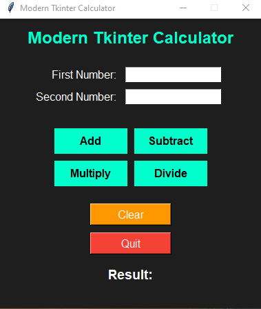
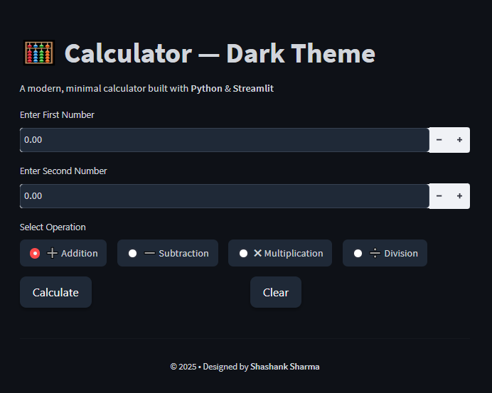

# 🧮 Modern Tkinter Calculator

A **modern GUI-based calculator** built using **Python** and **Tkinter**.  
This app performs basic arithmetic operations like **addition, subtraction, multiplication, and division** with a **clean UI**.

---

## 🚀 Features
- **Modern Dark UI** with an attractive design
- **Basic arithmetic operations** (+, -, ×, ÷)
- **Error handling** for invalid inputs & division by zero
- **Clear** button to reset fields
- **Exit confirmation** dialog
- Lightweight and beginner-friendly

---

## 🛠️ Tech Stack
- **Language:** Python 3.x
- **Library:** Tkinter (built-in)

---

## 📸 Screenshots

| Calculator UI | App UI |
|--------------|-----------------|
|  |  |

---

## 🧩 Installation & Setup

1. **Clone the repository**
   ```bash
   git clone https://github.com/Shashank270298/Modern-Tkinter-Calculator.git
   cd Modern-Tkinter-Calculator
   ```

2. **Create a virtual environment** *(Optional but recommended)*
   ```bash
   python -m venv venv
   source venv/bin/activate   # For Mac/Linux
   venv\Scripts\activate    # For Windows
   ```

3. **Install dependencies**
   ```bash
   pip install -r requirements.txt
   ```

4. **Run the application**
   ```bash
   python calculator.py
   ```

---


## 👤 Author
**Shashank Sharma**  
📧 Email: shashank270298@gmail.com 
🔗 [LinkedIn](https://www.linkedin.com/in/shashank-sharma-361288229/)

---

## ⭐ Contribute
If you like this project, **give it a star ⭐** on GitHub and share it with others!
